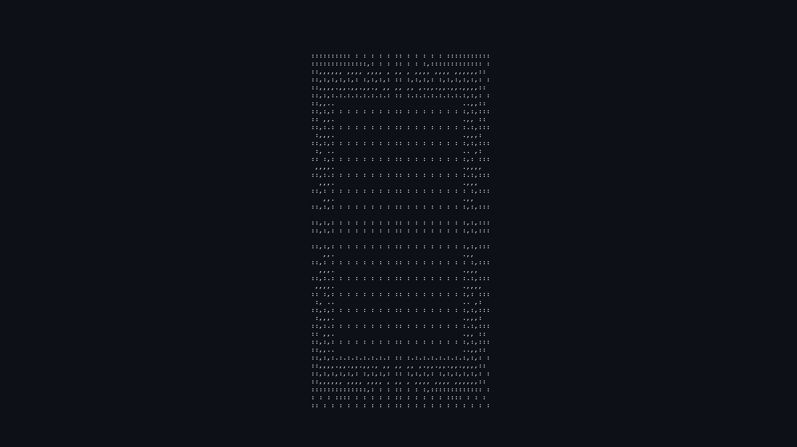

 # Olá 👋  
 
Meu nome é Mauricio😁  

Estudo na Uninter e no IFSC 🏫

Sou um animador 2D e 3D 🎬

Meu perfil no Artstation é:🖼

https://www.artstation.com/mauriciotellessilva

Trabalhando em um portifolio personalizado....

Estou me formando em:🎓

Análise e Desenvolvimento de Sistemas-IFSC

Design de Animação-Uninter

<!-- START_STATS -->

### 📈 Minhas Estatísticas de Desenvolvimento

* 🚀 **Repositorios:** Já contribuí com um total de **189 commits**.
* 🔀 **Pulls:** Foram abertos **9 Pull Requests**.
* 📊 **Commits:** nos meus repositórios, movimentei um total de $\color{#2ea44f}{\mathbf{+11,692}}$ **linhas adicionadas** e $\color{#f85149}{\mathbf{-7,299}}$ **linhas removidas**.
* 💻 **linguagens utilizadas:** Participacao de linguagens utilizadas:**Java (60.1%), HTML (39.9%)**.

_Atualizado automaticamente via Python Script (metrics.yml)._

<!-- END_STATS -->

  

