 # Olá 👋  
 
Meu nome é Mauricio😁  

Estudo na Uninter e no IFSC 🏫

Sou um animador 2D e 3D 🎬

Meu perfil no Artstation é:🖼

https://www.artstation.com/mauriciotellessilva

Estou me formando em:🎓

Análise e Desenvolvimento de Sistemas-IFSC

Design de Animação-Uninter

Atualmente trabalho como: 💻

Generalista 3D 

## 📊 Minhas Estatísticas do GitHub

Trabalho diário, linhas de código e tecnologias mais utilizadas atualizadas automaticamente.

<table>
  <tr>
    <td width="50%" align="center">
      
    </td>
    <td width="50%" align="center">
      
    </td>
  </tr>
  <tr>
    <td colspan="2" align="center">
      
    </td>
  </tr>
</table>
