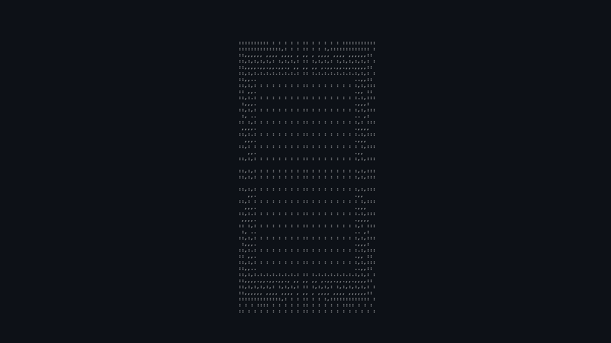

 # Olá 👋  
 
Meu nome é Mauricio😁  

Estudo na Uninter e no IFSC 🏫

Sou um animador 2D e 3D 🎬

Meu perfil no Artstation é:🖼

https://www.artstation.com/mauriciotellessilva

Estou me formando em:

Análise e Desenvolvimento de Sistemas-IFSC

Design de Animação-Uninter

<!-- START_STATS -->
<!-- END_STATS -->

# Materias IFSC
>Materias realizadas da graduação em ADS no IFSC separadas por semestre

## 1⁰ Semestre

- **Pensamento Computacional e Algoritimos:** [ ALG ](https://github.com/MauricioTellesSilva/ALG)
- **Introdução À Computação:** [ ICO ](https://github.com/MauricioTellesSilva/ADS-ifsc-ICO-2026-1) 

## 2⁰ Semestre

- **Programação Orientada a Objetos:** [ POO ](https://github.com/MauricioTellesSilva/poo)
- **Programação FrontEnd 1:** [ FE1 ](https://github.com/MauricioTellesSilva/ADS-IFSC-FEI-2026-2)

# Projetos Pessoais

- **Ultimate Viewer:** [ UVweb ](https://github.com/MauricioTellesSilva/Visualizador-3D)
- **Readme Metrics:** [ RdM ](https://github.com/MauricioTellesSilva/MauricioTellesSilva/blob/main/.github/workflows/metrics.yml)

  

