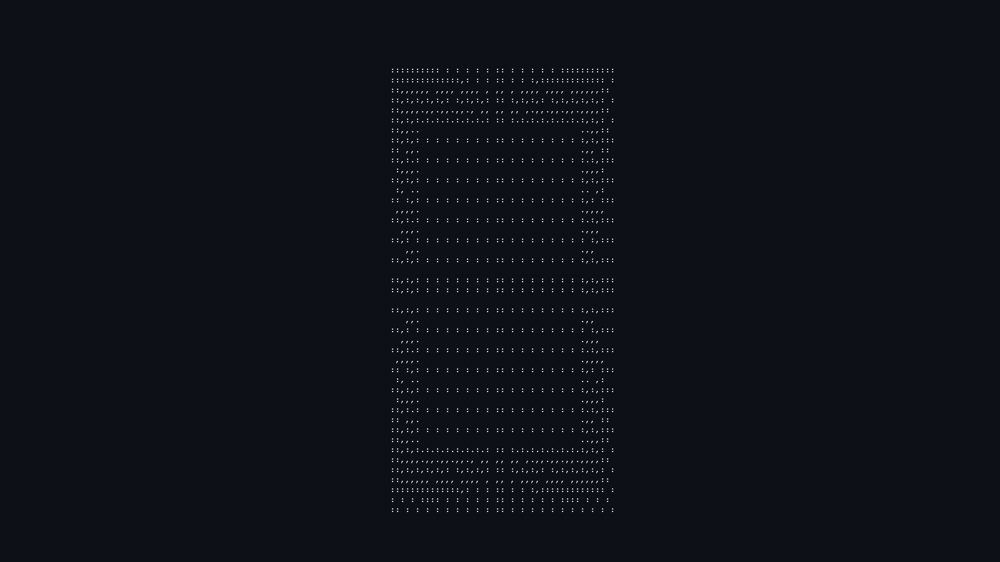

<div align="center">

```text
    █▄ ▄█ ▄▀▀▄ █  █ █▀▀▄ █ ▄▀▀▄ █ ▄▀▀▀▄      ▀▀█▀▀ █▀▀▀ █    █    █▀▀▀ ▄▀▀▀
    █ ▀ █ █▀▀█ █  █ █▀▀▄ █ █  ▄ █ █   █        █   █▀▀  █    █    █▀▀   ▀▀▄
   ▀   ▀ ▀  ▀  ▀▀  ▀  ▀ ▀  ▀▀  ▀  ▀▀▀         ▀   ▀▀▀▀ ▀▀▀▀ ▀▀▀▀ ▀▀▀▀ ▀▀▀
```

### Full-stack dev/3D Generalist

</div>

```json
{
  "focus":"3D->Hard Surface, Programming->Back-end",
  "education":["ADS-IFSC","Design de Animação-UNINTER"],
  "3D Stack":["Blender","Zbrush","Substance Painter","3Ds Max"],
  "Programming Stack":["Node.js","React","C#","TypeScript","Java"],
  "Want to Learn":["Rust","VFX"],
  "Old Github Account":"https://github.com/MauricioTSBichels"
}
``` 

## 📊 Minha atividade no GitHub

<!-- START_STATS -->

### 📈 Minhas Estatísticas de Desenvolvimento


* 🚀 **Repositorios:** Já contribuí com um total de **479 commits**.
* 🔀 **Pulls:** Foram abertos **23 Pull Requests**.
* 📊 **Commits:** nos meus repositórios, movimentei um total de $\color{#2ea44f}{\mathbf{+419,007}}$ **linhas adicionadas** e $\color{#f85149}{\mathbf{-68,526}}$ **linhas removidas**.
* 💻 **linguagens utilizadas:** Participacao de linguagens utilizadas:**TypeScript (44.1%), JavaScript (25.6%), C# (24.2%), CSS (2.9%)**.


_Atualizado automaticamente via Python Script (metrics.yml)._

<!-- END_STATS -->

## 🎓 Minha jornada no IFSC

Repositórios de estudos e atividades de Análise e Desenvolvimento de Sistemas, organizados por semestre.

### 1º semestre · Fundamentos

| Disciplina | Repositório |
| --- | --- |
| Pensamento Computacional e Algoritmos | [ALG](https://github.com/MauricioTellesSilva/ALG) |
| Introdução à Computação | [ICO](https://github.com/MauricioTellesSilva/ADS-ifsc-ICO-2026-1) |

### 2º semestre · Programação e interfaces

| Disciplina | Repositório |
| --- | --- |
| Programação Orientada a Objetos | [POO](https://github.com/MauricioTellesSilva/poo) |
| Programação Front-end I | [FE1](https://github.com/MauricioTellesSilva/ADS-IFSC-FEI-2026-2) |

## 🛠️ Projetos e experimentos

### Readme Metrics

Automação em **Python e GitHub Actions** que consulta a API do GitHub e atualiza as estatísticas deste perfil. Um projeto para explorar APIs, processamento de dados e automação na prática.

↳ [Ver o workflow](.github/workflows/metrics.yml)


<p align="center">
  
</p>

## 🖼️ Portfólio 3D

Meus trabalhos visuais também estão no [ArtStation](https://www.artstation.com/mauriciotellessilva).
